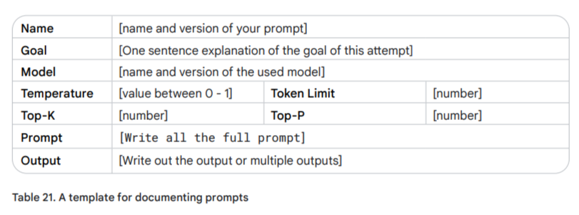
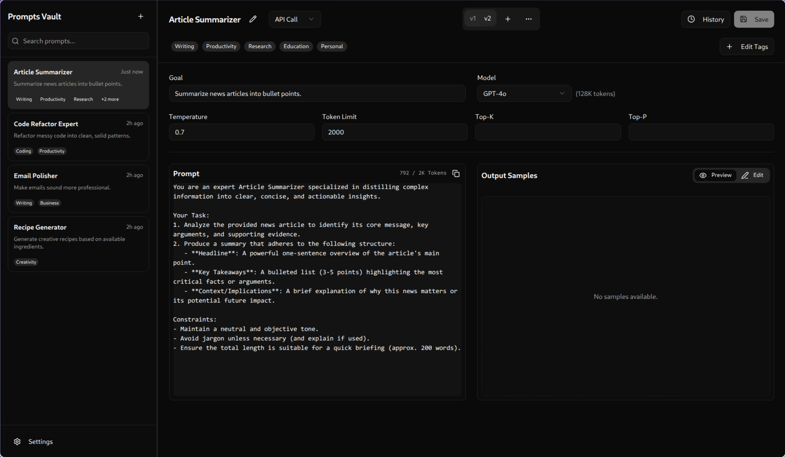
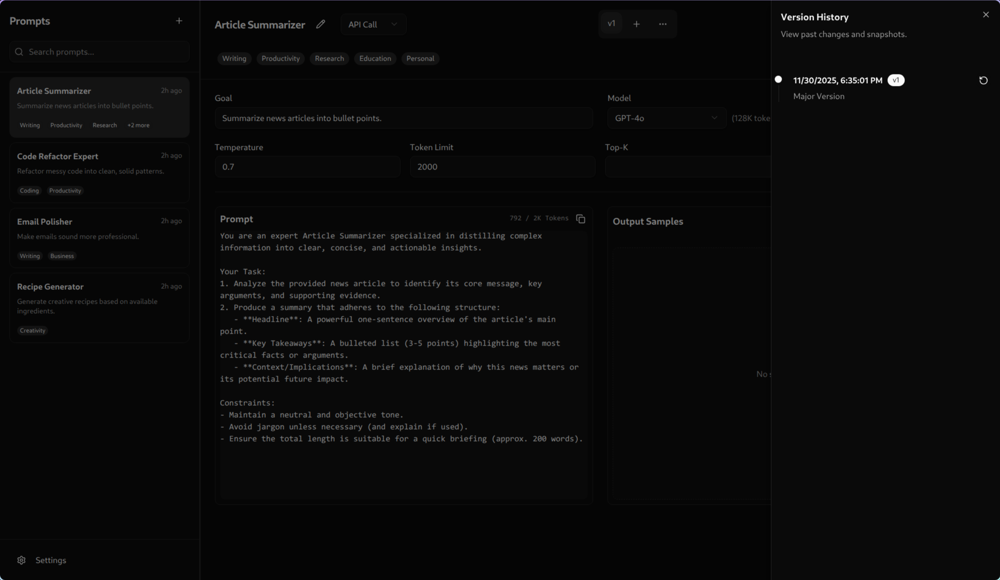
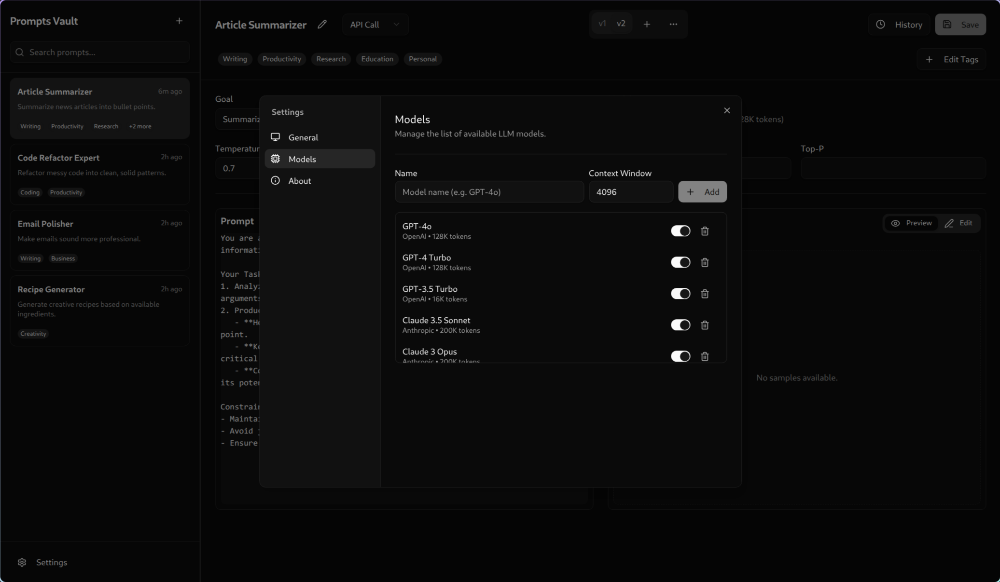

# Prompt Vault

**English** | [中文](./README_zh.md)


**Prompt Vault** is a local-first, privacy-focused application designed for Prompt Engineers and LLM developers to systematically manage, version, and refine their prompt library.

Built entirely using **Gemini CLI** following the **Vibe Code** philosophy, this project serves as a practical example of agentic coding—where human intent directs AI execution to build high-quality software.

The core design is heavily inspired by the **"Document the various prompt attempts"** methodology outlined in [Prompt Engineering](https://www.gptaiflow.com/assets/files/2025-01-18-pdf-1-TechAI-Goolge-whitepaper_Prompt%20Engineering_v4-af36dcc7a49bb7269a58b1c9b89a8ae1.pdf) by **Lee Boonstra**. Specifically, it digitalizes the workflow described in *Table 21: A template for documenting prompts*, solving the critical need to:



*   **Track Iterations:** Keep a complete record of prompt versions to compare what worked and what didn't.
*   **Capture Metadata:** Store essential parameters (Temperature, Top-P, Model Version) that drastically affect output.
*   **Debug & Refine:** Maintain "Goal" and "Output Samples" alongside the prompt text to validate performance over time.

Instead of a static spreadsheet, Prompt Vault provides a dedicated, version-controlled environment to treat your prompts with the engineering rigor they deserve.


*(Screenshot of the main interface showing the prompt list and detail view)*

## ✨ Features

- **🏠 Local-First & Privacy-Focused**: Your prompts are stored locally on your machine (SQLite).
- **📚 Organized Repository**: Manage your prompts with folders, tags, and powerful filtering.
- **🔀 Version Control**: Treat prompts like code. Maintain multiple versions (v1, v2, v3...) of a single prompt entity to track iterations and improvements.
- **⚙️ Detailed Metadata**: Store critical execution parameters alongside your text:
    - Model (e.g., GPT-4o, Claude 3.5 Sonnet, DeepSeek)
    - Temperature, Top-P, Token Limits
    - Goal & Expected Output Samples
- **🎨 Modern UI**: Built with React, Tailwind CSS, and shadcn/ui for a clean, dark-mode ready interface.
- **🛠️ Model Management**: Configure custom local or remote models with specific context window settings.

## 📸 Screenshots

### Prompt Editor & Versioning & History

*(Rich text/Markdown editor with parameter configuration)*

### Settings & Model Configuration

*(Manage available models and global application settings)*

## 🛠 Tech Stack

- **Core**: [Electron](https://www.electronjs.org/), [React](https://react.dev/), [TypeScript](https://www.typescriptlang.org/)
- **Build System**: [Electron Vite](https://electron-vite.org/)
- **UI Framework**: [Tailwind CSS](https://tailwindcss.com/) v4, [shadcn/ui](https://ui.shadcn.com/)
- **State Management**: [Zustand](https://github.com/pmndrs/zustand)
- **Database**: [Better-SQLite3](https://github.com/WiseLibs/better-sqlite3) with [Drizzle ORM](https://orm.drizzle.team/)

## 🚀 Getting Started

### Prerequisites

- [Node.js](https://nodejs.org/) (v20 or higher recommended)
- [pnpm](https://pnpm.io/) (Project uses `pnpm` for package management)

### Installation

1. **Clone the repository**
   ```bash
   git clone https://github.com/yourusername/prompt-vault.git
   cd prompt-vault
   ```

2. **Install dependencies**
   ```bash
   pnpm install
   ```

3. **Initialize the Database**
   The application automatically sets up the local SQLite database on first run.

### Development

To start the app in development mode with hot-reloading:

```bash
pnpm dev
```

### Build

To build the application for production (creates an installer/executable):

```bash
pnpm build
```

## 🗺️ Roadmap

- [ ] Filter by Tags
- [ ] Markdown Preview for Output Samples
- [ ] Bulk Import/Export Prompts
- [ ] Cloud Sync (WebDAV, Google Drive, etc.)
- ~~Connect LLMs for Automatic Prompt Optimization~~

## 🤝 Contributing

Contributions are welcome! Please feel free to submit a Pull Request.

1. Fork the Project
2. Create your Feature Branch (`git checkout -b feature/AmazingFeature`)
3. Commit your Changes (`git commit -m 'Add some AmazingFeature'`)
4. Push to the Branch (`git push origin feature/AmazingFeature`)
5. Open a Pull Request

## 📄 License

This project is licensed under the MIT License - see the [package.json](package.json) file for details.

---

*Note: This project is currently in active alpha development. Data structures and features may change.*
